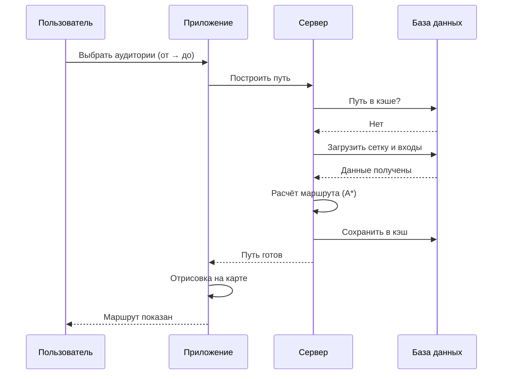

# Схема взаимодействия: Построение пути между аудиториями

## Общая архитектура

```
┌─────────────────┐         ┌─────────────────┐         ┌─────────────────┐
│                 │         │                 │         │                 │
│    КЛИЕНТ       │◄───────►│      API        │◄───────►│   PostgreSQL    │
│  (браузер/APP)  │         │   (бэкенд)      │         │   (база данных) │
│                 │         │                 │         │                 │
└─────────────────┘         └─────────────────┘         └─────────────────┘
       │                           │                           │
       │  1. Запрос пути           │                           │
       │     (от → до)             │                           │
       ├──────────────────────────►│                           │
       │                           │                           │
       │                           │  2. Проверка кэша         │
       │                           │     (PATH_CACHE)          │
       │                           ├──────────────────────────►│
       │                           │                           │
       │                           │  3. Данные кэша           │
       │                           │◄──────────────────────────┤
       │                           │                           │
       │                           │  4. Если нет в кэше:      │
       │                           │     - загрузка сетки      │
       │                           │     - загрузка входов     │
       │                           ├──────────────────────────►│
       │                           │                           │
       │                           │  5. Данные сетки/входов   │
       │                           │◄──────────────────────────┤
       │                           │                           │
       │                           │  6. Расчёт пути (A*)      │
       │                           │     и сохранение в кэш    │
       │                           ├──────────────────────────►│
       │                           │                           │
       │  7. Путь (координаты)     │                           │
       │◄──────────────────────────┤                           │
       │                           │                           │
       │  8. Отрисовка на карте    │                           │
       │                           │                           │
```

## Подробная последовательность



## Компоненты системы

### 🖥️ КЛИЕНТ (Frontend)

**Что делает:**
- Отображает карту корпуса и этажа
- Предоставляет UI для выбора аудиторий
- Отрисовывает построенный путь
- Показывает длину маршрута

**Технологии:**
- HTML5 Canvas / SVG для карты
- JavaScript/TypeScript
- React/Vue/Angular (опционально)

**Запросы к API:**
```javascript
// Запрос пути
POST /api/path
{
  "building_id": "bce65150-c95a-40cb-a59e-9774f5e1b249",
  "room_start": "141",
  "room_end": "251"
}

// Ответ
{
  "success": true,
  "data": {
    "path": [
      {"x": 61, "y": 228},
      {"x": 100, "y": 250},
      {"x": 150, "y": 300},
      ...
    ],
    "length": 150.5,
    "unit": "meters"
  }
}
```

---

### ⚙️ API (Backend)

**Что делает:**
- Принимает запросы от клиента
- Проверяет кэш путей
- Загружает данные из БД
- Выполняет алгоритм A*
- Кэширует результаты
- Возвращает путь клиенту

**Технологии:**
- Python (FastAPI/Flask) или Node.js (Express)
- Алгоритм A* для поиска пути
- Подключение к PostgreSQL

**Конечные точки:**
| Метод | Endpoint | Описание |
|-------|----------|----------|
| POST | `/api/path` | Построить путь |
| GET | `/api/buildings` | Список корпусов |
| GET | `/api/floors/{building_id}` | Список этажей |
| GET | `/api/rooms/{building_id}/{floor}` | Аудитории этажа |

**Логика работы:**
```python
async def get_path(building_id, room_start, room_end):
    # 1. Проверка кэша
    cached = await db.get_path_cache(building_id, room_start, room_end)
    if cached:
        return cached
    
    # 2. Загрузка данных
    entrances = await db.get_entrances(building_id)
    grids = await db.get_grids(building_id)
    
    # 3. Поиск входов
    start_entrance = find_entrance(entrances, room_start)
    end_entrance = find_entrance(entrances, room_end)
    
    # 4. A* алгоритм
    path = astar_pathfinding(
        start_entrance, 
        end_entrance, 
        grids.nodes, 
        grids.edges
    )
    
    # 5. Сохранение в кэш
    await db.save_path_cache(building_id, room_start, room_end, path)
    
    return path
```

---

### 🗄️ PostgreSQL (База данных)

**Что хранит:**
- Корпуса и этажи
- Аудитории и технические помещения
- Входы в помещения
- Навигационную сетку
- Кэш путей

**Схема данных:**
```
map_app (схема)
├── building          # Корпуса (32 записи)
├── floor             # Этажи (72 записи)
├── room              # Аудитории
├── technical         # Тех. помещения (лестницы, лифты)
├── entrance          # Входы (точки на карте)
├── grid              # Сетка навигации (JSON)
└── path_cache        # Кэш путей
```

**Ключевые запросы:**

```sql
-- Проверка кэша
SELECT path_nodes, path_length 
FROM map_app.path_cache
WHERE room_start_id = ? AND room_end_id = ?;

-- Загрузка входов
SELECT object_id, object_type, x, y, room_number
FROM map_app.entrance
WHERE building_id = ?;

-- Загрузка сетки
SELECT nodes, edges
FROM map_app.grid
WHERE building_id = ? AND floor_number = ?;

-- Сохранение пути в кэш
INSERT INTO map_app.path_cache 
    (building_id, room_start_id, room_end_id, path_nodes, path_length)
VALUES (?, ?, ?, ?, ?);
```

---

## Алгоритм работы A*

```
┌─────────────────────────────────────────────────────────────┐
│                    A* Pathfinding                           │
├─────────────────────────────────────────────────────────────┤
│                                                             │
│  1. Найти координаты входов:                               │
│     • Вход аудитории А (x₁, y₁)                            │
│     • Вход аудитории Б (x₂, y₂)                            │
│                                                             │
│  2. Найти ближайшие узлы сетки:                           │
│     • Node(start) — ближайший к входу А                    │
│     • Node(end) — ближайший к входу Б                      │
│                                                             │
│  3. Запустить A*:                                          │
│     • open_set = PriorityQueue()                           │
│     • g_score[start] = 0                                   │
│     • f_score[start] = heuristic(start, end)               │
│                                                             │
│  4. Пока open_set не пуст:                                 │
│     • current = node с минимальным f_score                 │
│     • если current == end: вернуть путь                    │
│     • для каждого соседа:                                  │
│       - tentative_g = g_score[current] + weight            │
│       - если лучше: обновить g_score, f_score              │
│                                                             │
│  5. Вернуть путь как список координат                      │
│                                                             │
└─────────────────────────────────────────────────────────────┘
```

---

## Примеры данных

### Запрос клиента
```json
{
  "building_id": "bce65150-c95a-40cb-a59e-9774f5e1b249",
  "room_start": "141",
  "room_end": "251"
}
```

### Ответ API
```json
{
  "success": true,
  "data": {
    "path": [
      {"x": 61, "y": 228},
      {"x": 80, "y": 240},
      {"x": 100, "y": 260},
      {"x": 150, "y": 300},
      {"x": 200, "y": 350},
      {"x": 250, "y": 400},
      {"x": 300, "y": 450}
    ],
    "length": 150.5,
    "unit": "meters",
    "floors": ["1", "2"],
    "transitions": [
      {
        "type": "stairs",
        "from_floor": "1",
        "to_floor": "2"
      }
    ]
  }
}
```

---

## Оптимизации

### 1. Кэширование путей
- Пути сохраняются в `path_cache`
- Ключ: `(room_start_id, room_end_id)`
- При изменении сетки — инвалидация кэша

### 2. Индексы в БД
```sql
CREATE UNIQUE INDEX idx_path_cache_rooms 
ON map_app.path_cache(room_start_id, room_end_id);

CREATE INDEX idx_grid_building_floor 
ON map_app.grid(building_id, floor_number);
```

### 3. Предварительная загрузка
- Загрузка сетки при выборе этажа
- Фоновая загрузка популярных маршрутов

---

## Обработка ошибок

| Ошибка | Код | Действие |
|--------|-----|----------|
| Аудитория не найдена | 404 | Показать сообщение пользователю |
| Нет входа у аудитории | 400 | Предложить выбрать другую |
| Путь не найден | 404 | Показать "Маршрут недоступен" |
| Ошибка БД | 500 | Логировать, показать "Ошибка сервера" |

---

## Масштабирование

```
                    ┌─────────────┐
                    │   Nginx     │
                    │  (балансер) │
                    └──────┬──────┘
                           │
         ┌─────────────────┼─────────────────┐
         │                 │                 │
   ┌─────▼─────┐    ┌─────▼─────┐    ┌─────▼─────┐
   │  API #1   │    │  API #2   │    │  API #3   │
   └─────┬─────┘    └─────┬─────┘    └─────┬─────┘
         │                │                │
         └────────────────┼────────────────┘
                          │
                   ┌──────▼──────┐
                   │  PostgreSQL │
                   │  (реплика)  │
                   └─────────────┘
```
