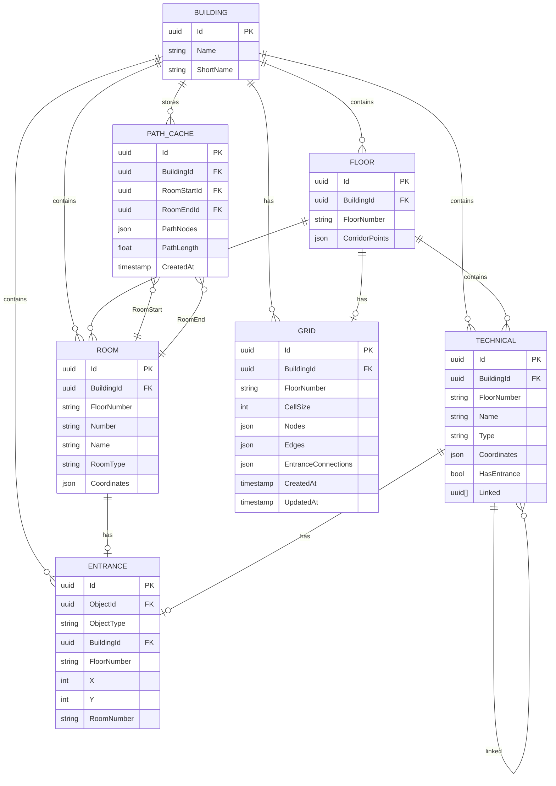

# Схема базы данных системы навигации

## Иерархия объектов

```
Корпус (Building)
├── Этаж (Floor)
│   ├── Коридор (Corridor) — полигон этажа
│   ├── Аудитория (Room)
│   │   └── Вход (Entrance) — точка входа
│   ├── Технический объект (Technical)
│   │   ├── Лестница ──┐
│   │   ├── Лифт ──────┤── Связи через
│   │   ├── Туалет     │    linked[] (UUID[])
│   │   ├── Охрана     │
│   │   └── ...        │
│   │   └── Вход (Entrance) — точка входа (для некоторых типов)
│   └── Сетка (Grid) — навигационный граф (JSON)
└── Кэш путей (PathCache)
```

## ER-диаграмма



## Описание таблиц

### 1. BUILDING (Корпуса)
Базовая таблица с информацией о корпусах.

| Поле | Тип | Описание |
|------|-----|----------|
| Id | UUID | Первичный ключ |
| Name | STRING | Полное название (например, "Восточное крыло главного корпуса") |
| ShortName | STRING | Краткое название (например, "1") |

### 2. FLOOR (Этажи)
Информация об этажах корпусов с геометрией коридоров.

| Поле | Тип | Описание |
|------|-----|----------|
| Id | UUID | Первичный ключ |
| BuildingId | UUID FK | Ссылка на BUILDING |
| FloorNumber | STRING | Номер этажа (1, 2, 3...) |
| CorridorPoints | JSON | Полигон коридора: `{"points": [{"x": 0, "y": 0}, ...]}` |

### 3. ROOM (Аудитории)
Помещения для обучения и работы.

| Поле | Тип | Описание |
|------|-----|----------|
| Id | UUID | Первичный ключ |
| BuildingId | UUID FK | Ссылка на BUILDING |
| FloorNumber | STRING | Номер этажа |
| Number | STRING | Номер аудитории (141, 251Б...) |
| Name | STRING | Полное название |
| RoomType | STRING | Тип (Учебная аудитория, Лаборатория...) |
| Coordinates | JSON | Полигон помещения |

### 4. TECHNICAL (Технические объекты)
Обобщённая таблица для всех технических объектов: лестницы, лифты, туалеты, охранные посты и т.д.

| Поле | Тип | Описание |
|------|-----|----------|
| Id | UUID | Первичный ключ |
| BuildingId | UUID FK | Ссылка на BUILDING |
| FloorNumber | STRING | Номер этажа |
| Name | STRING | Название (например, "Лестница №3") |
| Type | STRING | Тип: "Лестница", "Лифт", "Туалет", "Охрана", "Подсобное", "Гардероб", "Кафетерий", "Пункт питания", "Зона" |
| Coordinates | JSON | Полигон помещения |
| HasEntrance | BOOL | Можно ли устанавливать точку входа (true для лестниц/лифтов, false для туалетов) |
| Linked | UUID[] | Массив связанных объектов на других этажах (для лестниц и лифтов) |

**Примеры типов:**
- `Лестница` — лестничные клетки для межэтажного перехода
- `Лифт` — лифтовые шахты
- `Туалет` — санитарные комнаты
- `Охрана` — посты охраны, будки
- `Подсобное` — подсобные помещения, кладовые
- `Гардероб` — гардеробные комнаты
- `Кафетерий` / `Пункт питания` — места питания
- `Зона` — прочие технологические зоны

**Пример Linked (связи лестниц между этажами):**
```json
[
  "abc-123-def-456",  // Лестница на этаже 2
  "ghi-789-jkl-012"   // Лестница на этаже 3
]
```

### 5. ENTRANCE (Входы)
Точки входа в помещения (аудитории, технические помещения).

| Поле | Тип | Описание |
|------|-----|----------|
| Id | UUID | Первичный ключ |
| ObjectId | UUID FK | Ссылка на ROOM или TECHNICAL_ROOM |
| ObjectType | STRING | Тип объекта: "room" или "technical_room" |
| BuildingId | UUID FK | Ссылка на BUILDING |
| FloorNumber | STRING | Номер этажа |
| X | INT | Координата X точки входа |
| Y | INT | Координата Y точки входа |
| RoomNumber | STRING | Номер/название помещения для отображения |

### 6. GRID (Сетка навигации)
Навигационная сетка этажа в виде JSON (аналогично grid.json).

| Поле | Тип | Описание |
|------|-----|----------|
| Id | UUID | Первичный ключ |
| BuildingId | UUID FK | Ссылка на BUILDING |
| FloorNumber | STRING | Номер этажа |
| CellSize | INT | Размер клетки сетки (пиксели) |
| Nodes | JSON | Массив узлов: `[{x: 10, y: 20}, {x: 30, y: 20}, ...]` |
| Edges | JSON | Массив рёбер: `[{from: 0, to: 1, weight: 20.0}, ...]` |
| EntranceConnections | JSON | Подключённые входы: `[{entrance_id, entrance_x, entrance_y, connection_node_idx}, ...]` |
| CreatedAt | TIMESTAMP | Дата создания |
| UpdatedAt | TIMESTAMP | Дата обновления |

**Пример JSON для Nodes:**
```json
[
  {"x": 10, "y": 20},
  {"x": 30, "y": 20},
  {"x": 50, "y": 20}
]
```

**Пример JSON для Edges:**
```json
[
  {"from": 0, "to": 1, "weight": 20.0},
  {"from": 1, "to": 2, "weight": 20.0}
]
```

**Пример JSON для EntranceConnections:**
```json
[
  {
    "entrance_id": "abc-123",
    "entrance_x": 15,
    "entrance_y": 25,
    "connection_node_idx": 5
  }
]
```

### 7. PATH_CACHE (Кэш путей)
Кэшированные маршруты между аудиториями в рамках одного корпуса. Ключи — UUID аудиторий (ROOM.Id).

| Поле | Тип | Описание |
|------|-----|----------|
| Id | UUID | Первичный ключ |
| BuildingId | UUID FK | Ссылка на BUILDING (корпус) |
| RoomStartId | UUID FK | Аудитория отправления (ROOM.Id) |
| RoomEndId | UUID FK | Аудитория назначения (ROOM.Id) |
| PathNodes | JSON | Массив индексов узлов пути: `[0, 5, 12, 18, ...]` |
| PathLength | FLOAT | Общая длина пути (в пикселях/координатах) |
| CreatedAt | TIMESTAMP | Дата кэширования |

**Пример JSON для PathNodes:**
```json
{
  "path": [0, 5, 12, 18, 24, 31, 45, 52]
}
```

**Примечание:**
- Путь строится между входами аудиторий (ENTRANCE)
- Поддерживаются межэтажные переходы (лестницы/лифты) в рамках одного корпуса
- При изменении сетки этажа кэш нужно инвалидировать

## Индексы для оптимизации

```sql
-- Для быстрого поиска по корпусу и этажу
CREATE INDEX idx_room_building_floor ON ROOM(BuildingId, FloorNumber);
CREATE INDEX idx_tech_building_floor ON TECHNICAL(BuildingId, FloorNumber);
CREATE INDEX idx_entrance_building_floor ON ENTRANCE(BuildingId, FloorNumber);

-- Уникальный индекс: одна сетка на этаж
CREATE UNIQUE INDEX idx_grid_unique ON GRID(BuildingId, FloorNumber);

-- Для кэша путей: уникальный ключ на пару аудиторий
CREATE UNIQUE INDEX idx_path_cache_unique ON PATH_CACHE(RoomStartId, RoomEndId);
CREATE INDEX idx_path_cache_building ON PATH_CACHE(BuildingId);

-- GIN-индекс для массива Linked (PostgreSQL)
CREATE INDEX idx_tech_linked ON TECHNICAL USING GIN (Linked);
```

## Примеры данных

### JSON для полигона (Coordinates, CorridorPoints)
```json
{
  "points": [
    {"x": 61, "y": 228},
    {"x": 61, "y": 171},
    {"x": 302, "y": 171},
    {"x": 302, "y": 10},
    {"x": 7, "y": 10},
    {"x": 7, "y": 228}
  ]
}
```

### JSON для пути (PathNodes)
```json
{
  "path": [0, 5, 12, 18, 24, 31, 45, 52]
}
```

## Ограничения целостности

1. **Уникальность входов**: Один вход на объект (ROOM/TECHNICAL) в рамках этажа
2. **Связь с корпусом**: Все объекты (этажи, помещения, сетка) должны принадлежать корпусу
3. **Кэш путей**: Путь кэшируется только в рамках одного корпуса
4. **Сетка**: Одна запись GRID на этаж корпуса (уникальный индекс на BuildingId + FloorNumber)
5. **Технические объекты**: Поле `HasEntrance` определяет возможность установки точки входа:
   - `true` для лестниц и лифтов (навигационные точки)
   - `false` для туалетов, охранных постов, подсобок (только отображение)
6. **Связи технических объектов**: Массив `Linked` содержит UUID связанных объектов того же типа (лестница-лестница, лифт-лифт) на других этажах в рамках одного корпуса
